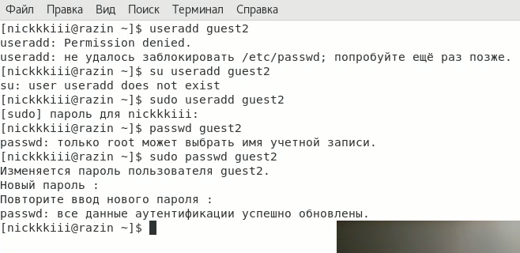
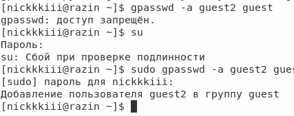
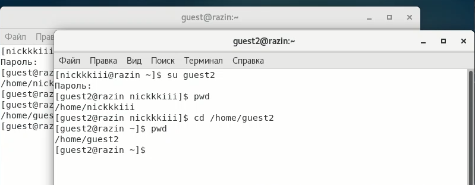
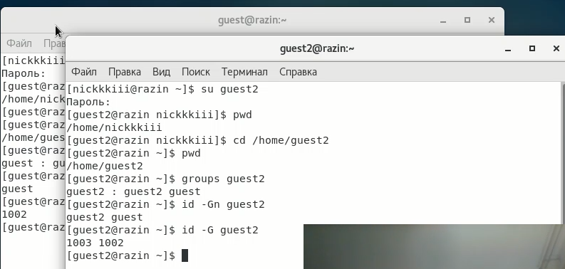
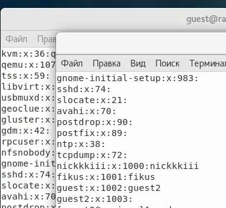
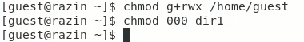
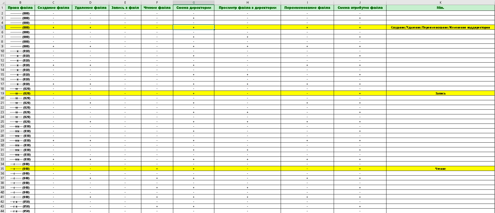
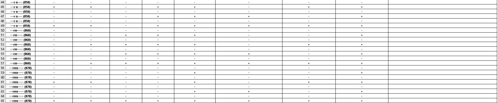

---
# Front matter
title: "Отчёт по лабораторной работе №3"
subtitle: "Дискреционное
разграничение прав в Linux. Два пользователя"
author: "Разин Никита Андреевич, НБИбд-402-18" 

# Generic otions
lang: ru-RU
toc-title: "Содержание"

# Bibliography
bibliography: bib/cite.bib
csl: pandoc/csl/gost-r-7-0-5-2008-numeric.csl

# Pdf output format
toc: true # Table of contents
toc_depth: 2
lof: true # List of figures
lot: true # List of tables
fontsize: 12pt
linestretch: 1.5
papersize: a4
documentclass: scrreprt
## I18n
polyglossia-lang:
  name: russian
  options:
	- spelling=modern
	- babelshorthands=true
polyglossia-otherlangs:
  name: english
### Fonts
mainfont: PT Serif
romanfont: PT Serif
sansfont: PT Sans
monofont: PT Mono
mainfontoptions: Ligatures=TeX
romanfontoptions: Ligatures=TeX
sansfontoptions: Ligatures=TeX,Scale=MatchLowercase
monofontoptions: Scale=MatchLowercase,Scale=0.9
## Biblatex
biblatex: true
biblio-style: "gost-numeric"
biblatexoptions:
  - parentracker=true
  - backend=biber
  - hyperref=auto
  - language=auto
  - autolang=other*
  - citestyle=gost-numeric
## Misc options
indent: true
header-includes:
  - \linepenalty=10 # the penalty added to the badness of each line within a paragraph (no associated penalty node) Increasing the value makes tex try to have fewer lines in the paragraph.
  - \interlinepenalty=0 # value of the penalty (node) added after each line of a paragraph.
  - \hyphenpenalty=50 # the penalty for line breaking at an automatically inserted hyphen
  - \exhyphenpenalty=50 # the penalty for line breaking at an explicit hyphen
  - \binoppenalty=700 # the penalty for breaking a line at a binary operator
  - \relpenalty=500 # the penalty for breaking a line at a relation
  - \clubpenalty=150 # extra penalty for breaking after first line of a paragraph
  - \widowpenalty=150 # extra penalty for breaking before last line of a paragraph
  - \displaywidowpenalty=50 # extra penalty for breaking before last line before a display math
  - \brokenpenalty=100 # extra penalty for page breaking after a hyphenated line
  - \predisplaypenalty=10000 # penalty for breaking before a display
  - \postdisplaypenalty=0 # penalty for breaking after a display
  - \floatingpenalty = 20000 # penalty for splitting an insertion (can only be split footnote in standard LaTeX)
  - \raggedbottom # or \flushbottom
  - \usepackage{float} # keep figures where there are in the text
  - \floatplacement{figure}{H} # keep figures where there are in the text
---

# Цель работы

Получение практических навыков работы в консоли с атрибутами файлов для групп пользователей.

# Задание

Получить практические навыки работы в консоли с атрибутами файлов и закрепить теоретические основы дискреционного разграничения доступа в современных системах с открытым кодом на базе ОС для групп пользователей.

# Теоретическое введение

Для каждого каталога и файла вы можете задать права доступа. Точнее права доступа автоматически задаются при создании каталога (файла), а вы, при необходимости, можете их изменить. Какая может быть необходимость?

Например, вам нужно, чтобы к вашему файлу-отчету смогли получить доступ пользователи — члены вашей группы. Или вы создали обычный текстовый файл, содержащий инструкции командного интерпретатора. Чтобы этот файл стал сценарием, вам нужно установить право на выполнение для этого файла. [[1]](https://itproffi.ru/atributy-fajlov-v-linux/)

Для записи кода режима доступа используется восьмеричная запись чисел. Как уже было отмечено, код доступа содержит три «триады» битов — для пользователя, группы и всех остальных, именно в таком порядке. Битам из первой триады соответствуют значения в восьмеричной записи 400, 200 и 100. Для второй триады (т. е. для группы) — 40, 20 и 10. Наконец, для третьей (все остальные) — 4, 2 и 1. В свою очередь, первому биту в каждой триаде соответствует доступ на чтение (r — «read»). Второму — на запись (w — «write») и третьему — на выполнение, т. е. x — «execute».[[2]](https://it.wikireading.ru/38589)

# Выполнение лабораторной работы

В установленной при выполнении первой лабораторной работы операционной системе с помощью команды useradd guest2 необходимо было создать нового пользователя guest2, также я задал пароль и после данные аунтефикации были успешно обновлены (пользователя guest мы создали в прошлой лабораторной работе) ([рис. 1](image/1.png))

{ #fig:001 width=70% }

После в терминале со стороны аккаунта администратора я добавил пользователя guest2 в группу пользователя guest ([рис. 2](image/2.png))

{ #fig:003 width=70% }

Далее я открыл два терминала и зашел в каждом из них за одного и другого пользователя и сразу же проверил домашнюю директорию ([рис. 3](image/3.png)).

{ #fig:008 width=70% }

Далее я определил командами groups guest и groups guest2, в какие группы входят пользователи guest и guest2. Сравнил вывод команды groups с выводом команд id -Gn и id -G (1002 и 1003,1002 - соответственно).

{ #fig:010 width=70% }

Сравнил полученную информацию с содержимым файла */etc/group*.
Просмотрел файл командой *cat /etc/group* и понял что данная информация идентична информации с прошлого пункта задания ([рис. 5](image/5.png)).

{ #fig:012 width=70% }

От имени пользователя guest2 выполнил регистрацию пользователя guest2 в группе guest командой *newgrp guest*
Далее я от имени пользователя guest изменил права директории /home/guest, разрешив все действия для пользователей группы с помощью команды *chmod g+rwx /home/guest*

После с помощью опытных операций над расширением или урезанием прав на директорию и файл в нем, я проверял какие операции доступны для проведения над файлом/директорией, а какие нет. ([рис. 7](image/6.png))

{ #fig:017 width=70% }

Ниже приведены скриншоты данной таблицы :

{ #fig:017 width=70% }
{ #fig:017 width=70% }
На основании заполненной таблицы я определил минимальные требования для операций над файлом, которые видны на вышеизложенных скриншотах.

Минимальные права для тех или иных операций сосредоточены в правом столбце **min**

# Выводы

Я получил практические навыки работы в консоли с атрибутами файлов для групп пользователей, а также закрепил теоретические основы дискреционного разграничения доступа в современных системах с открытым кодом на базе ОС Linux.

# Список литературы{.unnumbered}

1. [Атрибуты файлов в Linux](https://itproffi.ru/atributy-fajlov-v-linux/)
2. [Права доступа и атрибуты файла.](https://it.wikireading.ru/38589)
